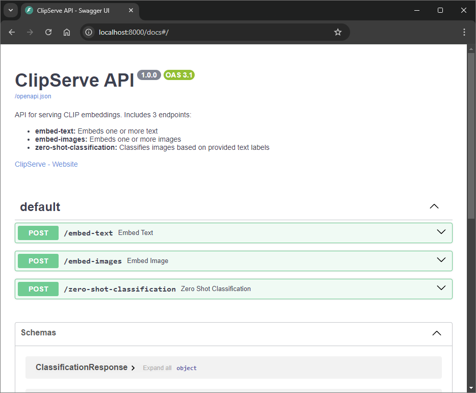
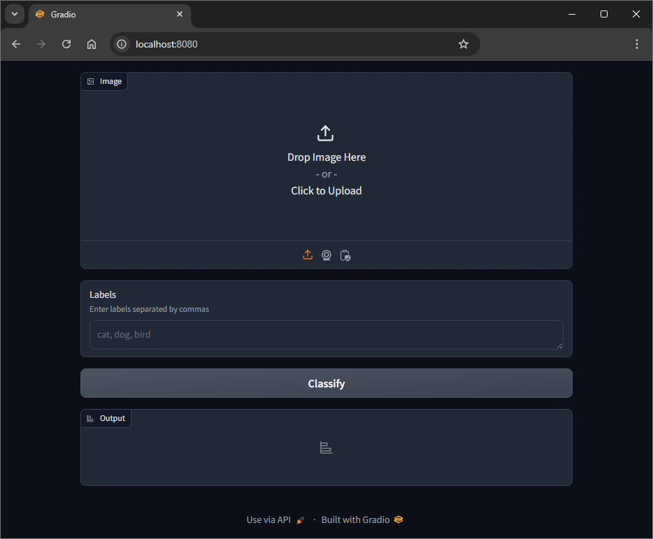

<div id="top"></div>
<br/>
<br/>

<h1 align=center>
    <a href="https://github.com/Armaggheddon/ClipServe">ClipServe</a>
</h1>

<p align="center">
<a href="https://github.com/Armaggheddon/ClipServe/commits/main">

</a>
<a href="https://github.com/Armaggheddon/ClipServe">

</a>
<a href="https://github.com/Armaggheddon/ClipServe/issues">

</a>
<a href="https://github.com/Armaggheddon/ClipServe/blob/main/LICENSE">

</a>
<!--<a href="https://github.com/Armaggheddon/ClipServe">

</a> -->
</p>

##
ClipServe is a blazing-fast inference server built on top of the powerful OpenAI CLIP model 🖼️📖. It provides easy-to-use API endpoints for embedding texts, embedding images, and performing zero-shot classification. With ClipServe, you can seamlessly integrate CLIP's capabilities into your applications with minimal overhead.

## ✨ Features
- 🚀 **Text Embedding:** Extract powerful embeddings for your texts using the CLIP model.
- 🖼️ **Image Embedding:** Convert your images into feature-rich embeddings in a snap.
- 🔄 **Zero-Shot Classification:** Perform zero-shot classification on multiple images and labels without any additional fine-tuning.
- ⚡ **Powered by CUDA (or not):** Experience lightning-fast inference powered by CLIP with CUDA for GPU acceleration, or run seamlessly on CPU-only for broader compatibility.
- 🔗 **API-Driven:** Leverage the flexibility of a REST API built with FastAPI for scalable and robust integrations.
- 🧰 **Redis Queue**: Efficient task management and concurrency with Redis for high-throughput systems.

## 🛠️ Tech Stack
- **FastAPI:** Fast and intuitive Python web framework.
- **Redis:** Asynchronous task queue for managing inference requests.
- **CLIP:** Multimodal vision-language model from OpenAI, utilized through the Hugging Face Transformers library for seamless integration. 
- **CPU or GPU:** Supports inference on both GPU for accelerated performance or CPU for broader accessibility.

## 🔌 API Endpoints
### 1. `/embed-text` 📝
Embed one or multiple pieces of text
- **Method:** `POST`
- **Request:**
    ```json
    {
        "text": "text to embed"
    }
    
    OR
    
    {
        "text": [
            "text to embed1",
            ...
        ]
    }
    ```
- **Response:**
    ```json
    {
        "model_name": "openai/clip-vit-base-patch32",
        "text_embeddings": [
            {
                "text": "text to embed",
                "embedding": [
                    0.10656972229480743,
                    ...
                ]
            },
            ...
        ]
    }
    ```

### 2. `embed-image` 🖼️
Embed one or multiple images. The images are sent as base64 encoded strings with the uri metadata, e.g. `data:image/jpeg;base64,<base64 encoded image>`.
- **Method:** `POST`
- **Request:**
    ```json
    {
        "image_b64": "data:image/jpeg;base64,<base64 encoded image>"
    }

    OR

    {
        "image_b64": [
            "data:image/jpeg;base64,<base64 encoded image>",
            ...
        ]
    }
    ```
- **Response:**
    ```json
    {
        "model_name": "openai/clip-vit-base-patch32",
        "image_embeddings": [
            {
                "image_id": "uuid_for_images_in_request",
                "embedding": [
                    -0.20458175241947174,
                    ...
                ]
            },
            ...
        ]
    }
    ```

### 3. `/zero-shot-classification` 🎯
Perform zero-shot classification on images given a list of text labels.
- **Method:** `POST`
- **Request:**
    ```json
    {
        "labels": [
            "label1",
            ...
        ],
        "images_b64": [
            "data:image/jpeg;base64,<base64 encoded image>",
            ...
        ]
    }
    ```
- **Response:**
    ```json
    {
        "model_name": "openai/clip-vit-base-patch32",
        "text_embeddings": [
            {
                "text": "label1",
                "embedding": [
                    -0.21665547788143158,
                    ...
                ]
            },
            ...
        ],
        "image_embeddings": [
            {
                "image_id": "uuid1",
                "embedding": [
                    0.48072099685668945,
                    ...
                ]
            },
            ...
        ],
        "classification_result": {
            "labels": [
                "label1",
                ...
            ],
            "softmax_outputs": [
                {
                    "image_id": "uuid1",
                    "softmax_scores": [
                        0.876521455,
                        ...
                    ]
                },
                ...
            ]
        }
    }
    ```

## 🚀 Getting Started

### Prerequisites
- **Docker 🐳:** Install Docker with the Docker Compose plugin ([Overview of Installing Docker](https://docs.docker.com/compose/install/)).
- **GPU Requirements 💻:** For GPU-enabled Docker Compose, you need an NVIDIA GPU with updated drivers and the NVIDIA Container Toolkit ([Installing NVIDIA Container Toolkit](./docs/installing_nvidia_container_toolkit.md))

### Installation
1. Clone the repository:
    ```bash
    git clone https://github.com/Armaggheddon/ClipServe
    cd ClipServe
    ```

1. Build the containers:
    - **Cpu** only version
        ```bash
        docker compose -f cpu-docker-compose.yml build
        ```
    - **Gpu** enabled version
        ```bash
        docker compose -f gpu-docker-compose.yml build
        ```

1. Start the container:
    - **Cpu** only version:
        ```bash
        docker compose -f cpu-docker-compose.yml up
        ```
    - **Gpu** enabled version:
        ```bash
        docker compose -f gpu-docker-compose.yml up
        ```
    >[!NOTE]
    > Add option `-d` to the start command to start the containers in detached mode, e.g. `docker compose -f <file>.yml up -d`

## Customizations ⚙️
ClipServe offers a variety of customization options through two environment configuration files: `container_configs.env` and `.env`.

### 1. `container_configs.env` 🔧
This file allows you to configure key aspects of the application, including API documentation visibility and the CLIP model to use for inference.
- `SHOW_API_DOCS`: Set to `true` or `false` to show or hide the OpenAPI documentation for the API.

- `CLIP_MODEL_NAME`: Choose which CLIP model to use for inference. Available models:
    - `openai/clip-vit-base-patch32`
    - `openai/clip-vit-large-patch14`
    - `openai/clip-vit-base-patch16`
    - `openai/clip-vit-large-patch14-336`

### 2. `.env` ⚙️
This file is used to configure the exposed ports for both the API and the web UI.
- `WEB_API_EXPOSED_PORT`: Set the port for accessing the API.
- `WEB_UI_EXPOSED_PORT`: Set the port for accessing the web UI.

### 3. Disabling the Web UI 🚫
If you don't need the Gradio-powered web UI, you can easily disable it by commenting out or removing the corresponding service in the `cpu/gpu-docker-compose.yml` file:
```yaml
services:

#   web_ui:
#     build:
#       context: ./web_ui
#       dockerfile: Dockerfile_webui
#     ports:
#       - "${WEB_UI_EXPOSED_PORT}:7860"
#     depends_on:
#       - api

  api:
    build:
    ...
```
<hr>
These configurations make ClipServe flexible and adaptable to different use cases. Customize it to fit your needs! 🛠️

## Screenshots 📸
Here’s a glimpse of ClipServe in action:

### 1. API Documentation (OpenAPI) 📜
Easily explore and test the API with the built-in OpenAPI documentation.



### 2. Gradio Web UI 🎨
Interact with the model directly via the Gradio-powered web UI for an intuitive experience.



## Usage Example 🚀
To get started with ClipServe, we’ve included some example code in the [`client_example`](./client_example/) folder. This will help you quickly interact with the API endpoints for embedding text, embedding images, and performing zero-shot classification.

### Running the example
1. Make sure ClipServe is up and running using Docker Compose.
1. Navigate to the client_example folder and execute the provided scripts.

Here’s an example of how to use the text embedding API:
```python
import requests

# URL of the ClipServe API
api_url = "http://localhost:<WEB_API_EXPOSED_PORT>/embed-text"

# Sample text data
data = {
    "text": [
        "A photo of a cat",
        "A beautiful landscape with mountains"
    ]
}

# Make a POST request to the API
response = requests.post(api_url, json=data)

# Display the results
if response.status_code == 200:
    print(response.json())
else:
    print(f"Error: {response.status_code}")
```

For more a more detailed example, check out the [`client_example.py`](./client_example/client_example.py) file, which contains code for text embedding, image embedding, and zero-shot classification.


### Easier API Interaction 🛠️
The [`clip_serve_models.py`](./client_example/clip_serve_models.py) file includes all the required models that make it easier to operate with the API. These models are provided to help you format requests and handle responses more effectively.